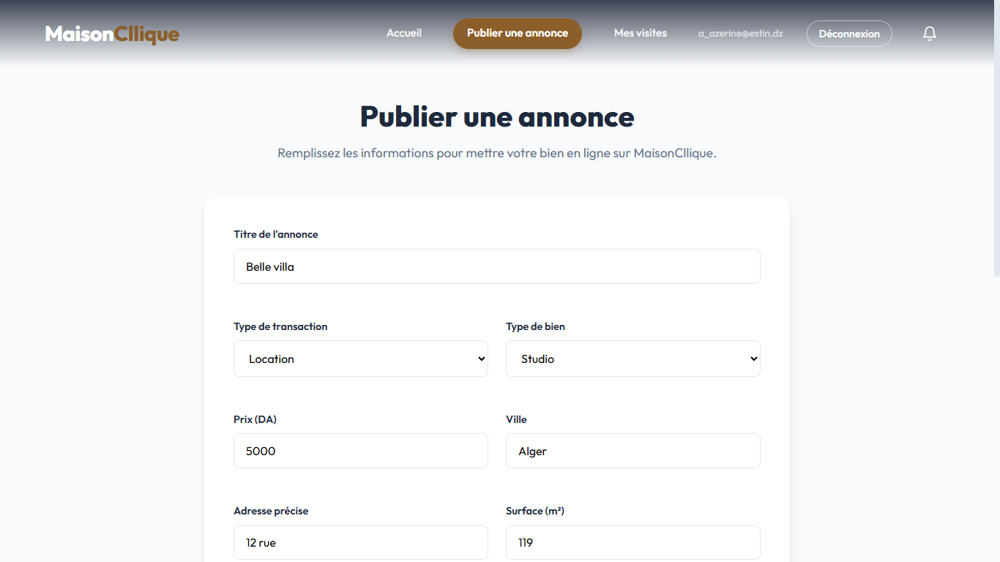
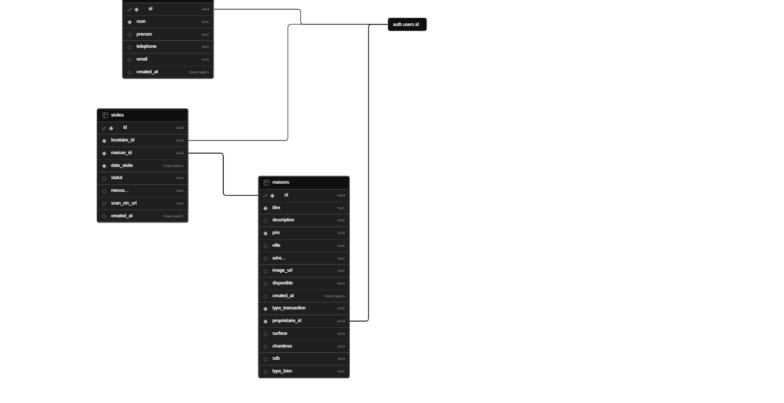

# Maison Click

Bienvenue sur le dépôt de **Maison Click**, une plateforme immobilière moderne et intuitive. 
Cette application permet aux utilisateurs de parcourir, rechercher et publier des annonces immobilières (maisons, appartements, terrains, etc.).

## 📸 INTERFACE:

### Page d'Accueil


### Seller Interface


### Buyer Interface


## 🎯 Problem Statement

Home seekers and real estate agencies in the digital market face several challenges during the property search and listing process. The traditional experience involves:
- **Information Fragmentation**: Users have to jump between multiple social media groups and unorganized classified sites to find listings.
- **Lack of Detail**: Most platforms fail to show essential property metrics at a glance (e.g., number of beds, baths, and square footage).
- **Poor Mobile Optimization**: Many real estate websites are not responsive, making it difficult for users to browse properties on the go.
- **Visual Clutter**: Overly complex interfaces that distract users from the primary goal: viewing the property.

Similarly, real estate agencies lack a professional digital space to:
- **Showcase Premium Inventory**: Agencies need a clean, dedicated environment to present high-quality property images and details.
- **Build Brand Authority**: Without a professional website, agencies struggle to establish trust with high-end clients.
- **Organize Services**: Difficulty in clearly communicating different business lines like rentals, sales, and consultations.

## 💡 Solution

**Maison Click** is a high-performance, modern web platform designed to streamline the real estate experience. The platform provides:
- **For Property Seekers**: A minimalist, visual-first interface to browse luxury villas, apartments, and studios with clear property specifications.
- **For Agencies/Owners**: A professional, multi-page application to showcase property listings, explain services, and capture leads via an integrated system.
- **Modern UI/UX**: A fully responsive design optimized for speed and readability, ensuring a premium experience on any device.

## ✨ Features

### 1. Property Discovery & Search
- **Advanced Filters**: A visual search bar allowing users to filter by Location, Property Type, and Price Range.
- **Property Highlights**: Dynamic cards showing price, location, and key specs.
- **Status Badges**: Visual indicators for different listing categories (available, rented).

### 2. Agency & Owner Services
- **Service Catalog**: Dedicated categories for buying, selling, and property management.
- **Dashboard**: A personalized space for owners and seekers to track their visits and listings.
- **Client Testimonials**: A social proof section to build trust through user feedback.

### 3. Navigation & Interaction
- **Responsive Navigation**: A sticky header with mobile-friendly links.
- **Interactive Forms**: User-friendly property submission and contact forms.
- **Secure Authentication**: Protected routes ensuring that only verified users can post properties or book visits.

## 🚀 Technologies Utilisées

### Frontend
- **Framework** : React 19 (via Vite)
- **Langage** : JavaScript (ESM, ECMA 2020+)
- **Routage** : React Router v7 (`react-router-dom`)
- **Stylisation** : CSS Moderne (fichiers `.css` dédiés par composant/page)
- **Icônes** : SVG Inline personnalisés

### Backend & Services
- **Backend** : Supabase (`@supabase/supabase-js`)
  - Authentification des utilisateurs
  - Base de données PostgreSQL (gestion des annonces immobilières)
  - Stockage (hébergement des images des biens)

### Development Tools
- **Linting** : ESLint (règles pour React & React Hooks)
- **Build Tool** : Vite
- **Package Manager** : npm

## 🧭 Navigation Flow

```text
[ Visitor ]
    │
    ├──► [ / (Home) ] ──────────► [ Search/Filter Listings ]
    │        │
    │        ├─► [ /about ] ────► [ Agency Information ]
    │        │
    │        ├─► [ /categorie ] ─► [ Specific Category Listings ]
    │        │
    │        ├─► [ /maison/:id ] ─► [ Detailed Property View ]
    │        │
    │        └─► [ /login ] ────► [ Authentication ]
    │
[ Authenticated User / Owner ]
    │
    ├──► [ /dashboard ] ────────► [ Manage Visits/Appointments ]
    │
    └──► [ /publier ] ──────────► [ Add New Property ]
```

## 📁 Structure du Projet

```text
maison click/
├── public/                      # Fichiers publics statiques
├── src/
│   ├── components/              # Composants réutilisables
│   │   └── Navbar.jsx
│   ├── pages/                   # Vues principales de l'application
│   │   ├── About.jsx
│   │   ├── AddProperty.jsx      # Formulaire d'ajout
│   │   ├── Category.jsx
│   │   ├── Dashboard.jsx
│   │   ├── Home.jsx             # Accueil et recherche
│   │   ├── Login.jsx
│   │   ├── Maison.jsx           # Vue détaillée d'un bien
│   │   └── Register.jsx
│   ├── App.jsx                  # Configuration du routage
│   ├── main.jsx                 # Point d'entrée React
│   ├── index.css                # Styles globaux
│   └── supabaseClient.js        # Client et configuration Supabase
├── screenshots/                 # Captures d'écran de l'interface
├── .env                         # Variables d'environnement
├── package.json                 # Dépendances du projet
├── vite.config.js               # Configuration de Vite
└── README.md
```

## 🗄️ Schéma de la Base de Données



Voici la structure des tables PostgreSQL de notre backend Supabase :

### Table `locataires`
| Colonne | Type | Requis | Défaut |
|---|---|---|---|
| `id` | uuid | Oui | |
| `nom` | text | Oui | |
| `prenom` | text | Non | |
| `telephone` | text | Non | |
| `email` | text | Non | |
| `created_at` | timestampz | Non | now() |

### Table `maisons`
| Colonne | Type | Requis | Défaut |
|---|---|---|---|
| `id` | uuid | Oui | gen_random_uuid() |
| `titre` | text | Oui | |
| `description` | text | Non | |
| `prix` | bigint | Oui | |
| `ville` | text | Non | |
| `adresse` | text | Non | |
| `image_url` | text | Non | |
| `disponible` | boolean | Non | true |
| `type_transaction` | text | Oui | 'location' |
| `proprietaire_id` | uuid | Oui | |
| `surface` | integer | Non | |
| `chambres` | integer | Non | |
| `sdb` | integer | Non | |
| `type_bien` | text | Non | 'appartement' |
| `created_at` | timestampz | Non | now() |

### Table `visites`
| Colonne | Type | Requis | Défaut |
|---|---|---|---|
| `id` | uuid | Oui | gen_random_uuid() |
| `locataire_id` | uuid | Oui | |
| `maison_id` | uuid | Oui | |
| `date_visite` | timestampz | Oui | |
| `statut` | text | Non | 'en_attente' |
| `message` | text | Non | |
| `scan_cin_url` | text | Non | |
| `created_at` | timestampz | Non | now() |

## 🛠️ Installation et Lancement Local

Pour exécuter ce projet localement, suivez ces étapes :

### 1. Cloner le dépôt
```bash
git clone <votre-url-de-repo>
cd "maison click"
```

### 2. Installer les dépendances
```bash
npm install
```

### 3. Configuration des variables d'environnement
Créez un fichier `.env` à la racine du projet et ajoutez vos clés Supabase :
```env
VITE_SUPABASE_URL=votre_url_supabase
VITE_SUPABASE_ANON_KEY=votre_cle_anon_supabase
```

### 4. Lancer le serveur de développement
```bash
npm run dev
```
L'application sera accessible sur `http://localhost:5173`.

## 🤝 Contribution

Les contributions, problèmes (issues) et demandes de fonctionnalités (feature requests) sont les bienvenus !
N'hésitez pas à vérifier les *issues* existantes si vous souhaitez contribuer.

## 📝 Scripts Disponibles

- `npm run dev` : Démarre le serveur de développement.
- `npm run build` : Compile l'application pour la production.
- `npm run lint` : Vérifie le code avec ESLint.
- `npm run preview` : Prévisualise l'application compilée localement.
